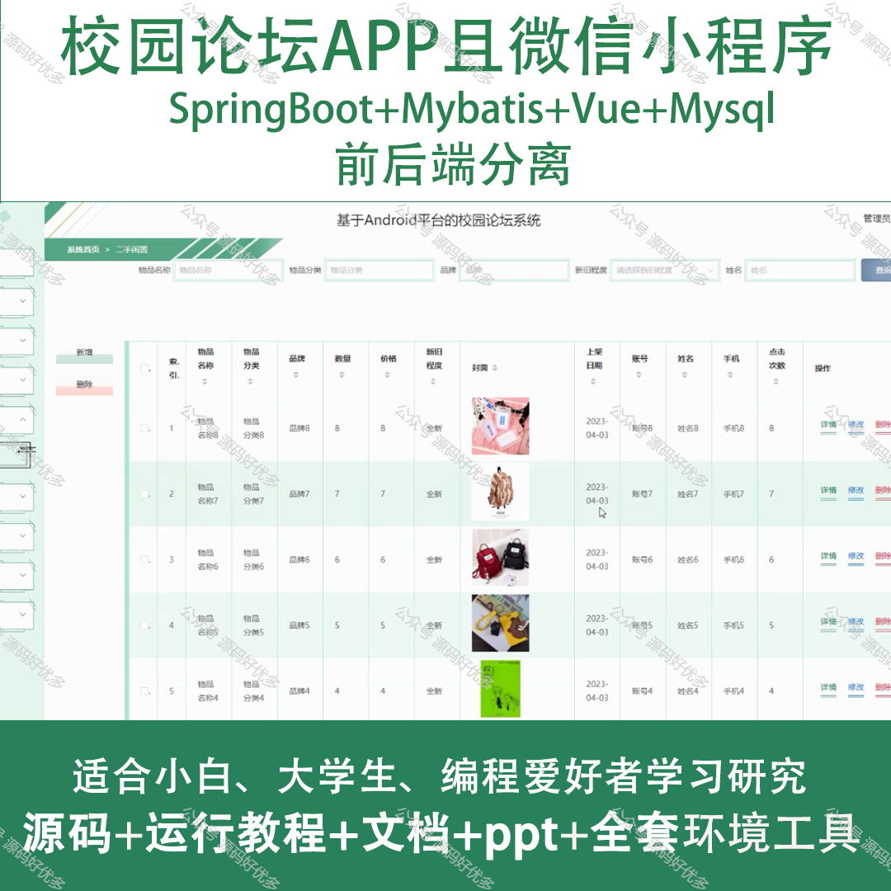
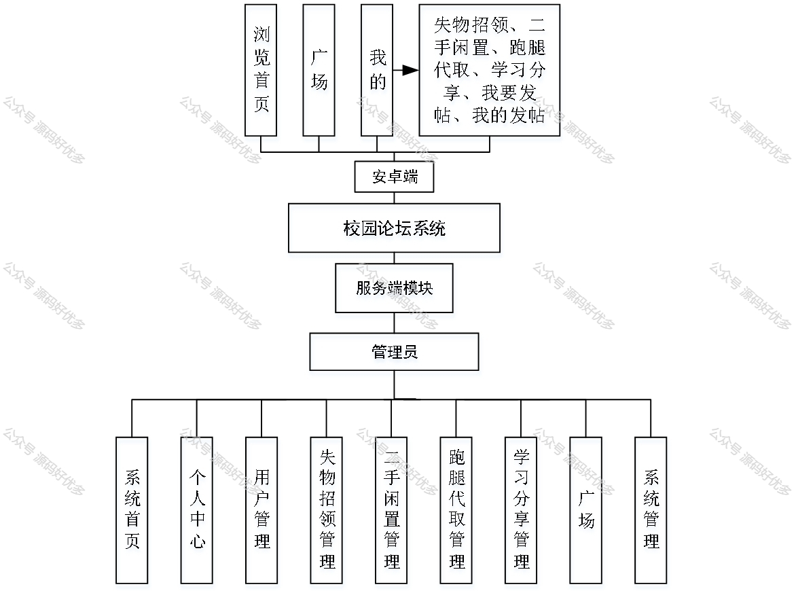
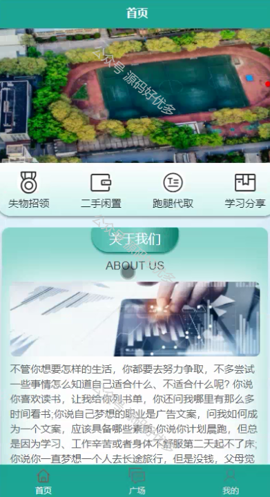
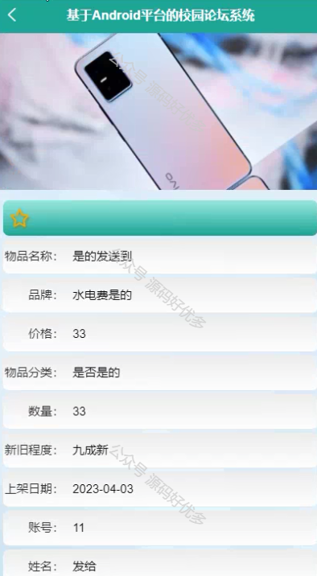
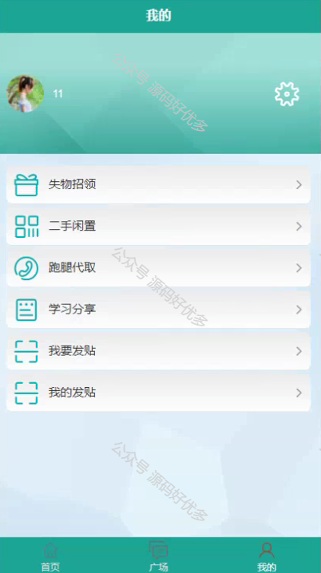
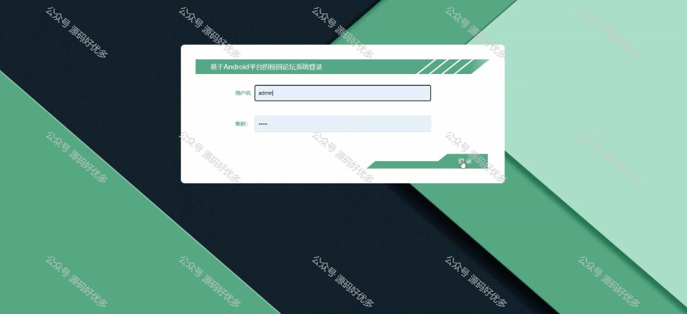
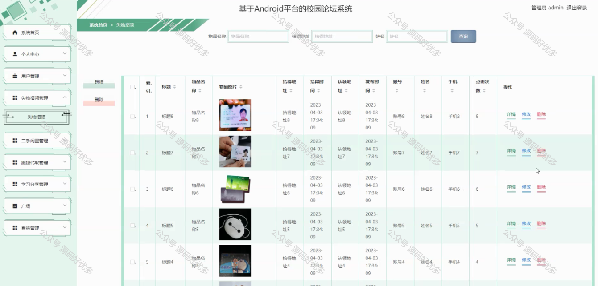
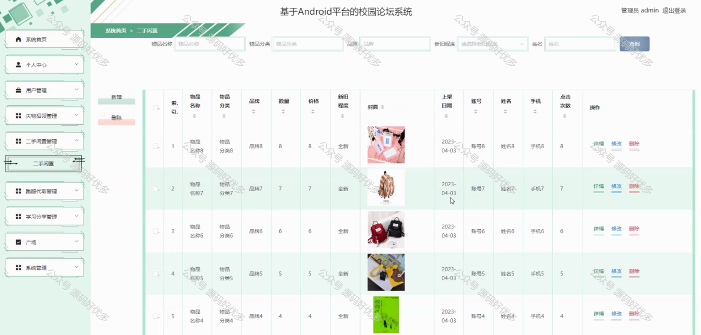
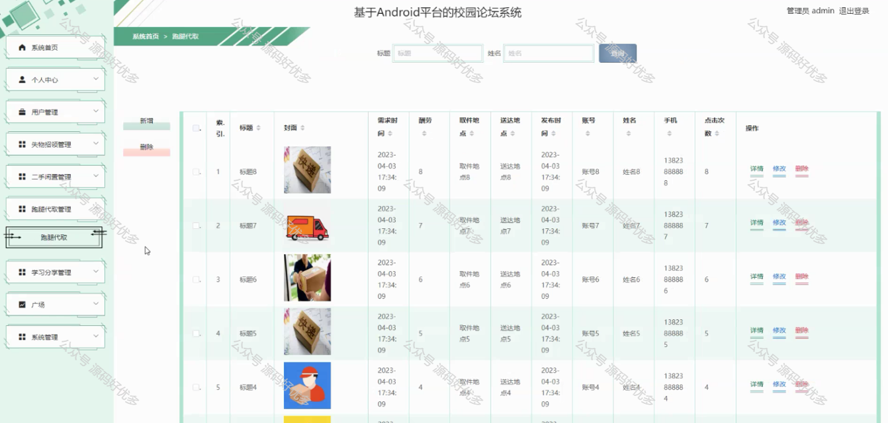
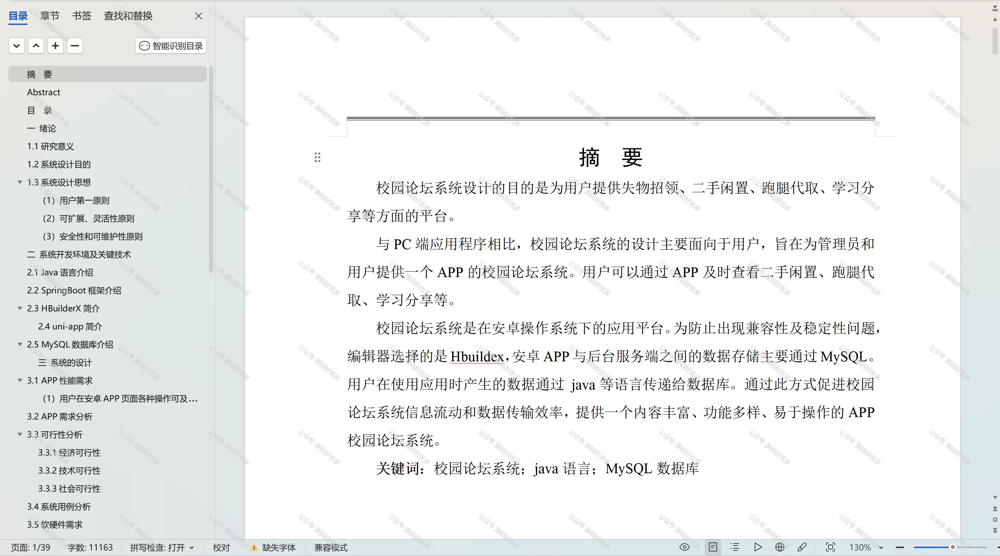

 
## 查看主页获取源码

> **作者介绍**： **✌**全网粉丝10W+本平台特邀作者、博客专家、CSDN新星计划导师、java领域优质创作者,博客之星、掘金/华为云/阿里云/InfoQ等平台优质作者、专注于项目实战 **✌**

  

### 一、作品包含

源码+数据库+设计文档万字+PPT+全套环境和工具资源+部署教程

### 二、项目技术

前端技术：Html、Css、Js、Vue、Element-ui

数据库：MySQL

后端技术：Java、Spring Boot、MyBatis

  

### 三、运行环境

开发工具：IDEA/eclipse + 微信开发者工具

数据库：MySQL5.7

数据库管理工具：Navicat10以上版本

环境配置软件： JDK1.8+Maven3.6.3

前端Nodejs：14

### 四、项目介绍
项目编号：mpweixinA047

校园论坛APP及微信小程序以丰富校园文化生活、促进师生交流为背景，为在校师生提供了一个线上互动平台。该应用旨在加强校园内部的沟通与合作，激发学生的创造力和参与感，同时为校园生活增添更多便捷和乐趣。

前台用户功能：浏览首页、广场、失物招领、二手闲置、跑腿代取、学习分享、我要发帖、我的发帖。

后台管理员的功能：系统首页、个人中心、用户管理、失物招领管理、二手闲置管理、跑腿代取管理、学习分享管理、广场、系统管理。

### 五、运行截图

  
